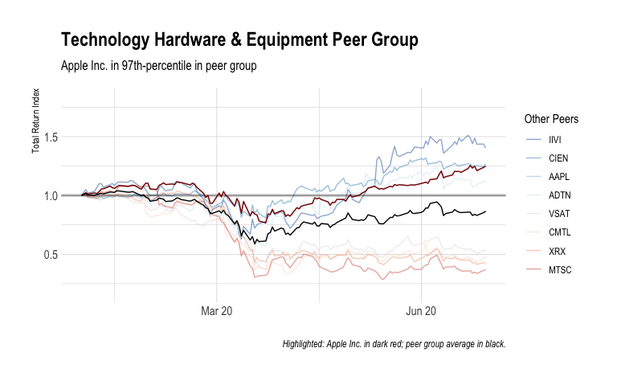
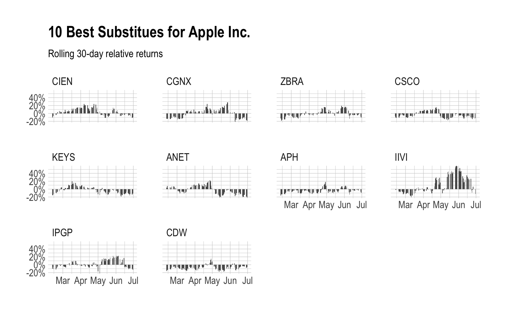

Peer correlations
================

## Prepare correlation data set

``` r
cur_sec <- "AAPL"
start_date <- "2019-12-31"
end_date <- "2020-06-30"
```

### Full-period return plot (top/bottom by return)



### Full-period correlation table (top-10 by correlation)

<style>html {
  font-family: -apple-system, BlinkMacSystemFont, 'Segoe UI', Roboto, Oxygen, Ubuntu, Cantarell, 'Helvetica Neue', 'Fira Sans', 'Droid Sans', Arial, sans-serif;
}

#ljmbwcmybk .gt_table {
  display: table;
  border-collapse: collapse;
  margin-left: auto;
  margin-right: auto;
  color: #333333;
  font-size: small;
  font-weight: normal;
  font-style: normal;
  background-color: #FFFFFF;
  width: auto;
  border-top-style: solid;
  border-top-width: 2px;
  border-top-color: #A8A8A8;
  border-right-style: none;
  border-right-width: 2px;
  border-right-color: #D3D3D3;
  border-bottom-style: solid;
  border-bottom-width: 2px;
  border-bottom-color: #A8A8A8;
  border-left-style: none;
  border-left-width: 2px;
  border-left-color: #D3D3D3;
}

#ljmbwcmybk .gt_heading {
  background-color: #FFFFFF;
  text-align: left;
  border-bottom-color: #FFFFFF;
  border-left-style: none;
  border-left-width: 1px;
  border-left-color: #D3D3D3;
  border-right-style: none;
  border-right-width: 1px;
  border-right-color: #D3D3D3;
}

#ljmbwcmybk .gt_title {
  color: #333333;
  font-size: 125%;
  font-weight: initial;
  padding-top: 4px;
  padding-bottom: 4px;
  border-bottom-color: #FFFFFF;
  border-bottom-width: 0;
}

#ljmbwcmybk .gt_subtitle {
  color: #333333;
  font-size: 85%;
  font-weight: initial;
  padding-top: 0;
  padding-bottom: 4px;
  border-top-color: #FFFFFF;
  border-top-width: 0;
}

#ljmbwcmybk .gt_bottom_border {
  border-bottom-style: solid;
  border-bottom-width: 2px;
  border-bottom-color: #D3D3D3;
}

#ljmbwcmybk .gt_col_headings {
  border-top-style: solid;
  border-top-width: 2px;
  border-top-color: #D3D3D3;
  border-bottom-style: solid;
  border-bottom-width: 2px;
  border-bottom-color: #D3D3D3;
  border-left-style: none;
  border-left-width: 1px;
  border-left-color: #D3D3D3;
  border-right-style: none;
  border-right-width: 1px;
  border-right-color: #D3D3D3;
}

#ljmbwcmybk .gt_col_heading {
  color: #333333;
  background-color: #FFFFFF;
  font-size: 80%;
  font-weight: bolder;
  text-transform: uppercase;
  border-left-style: none;
  border-left-width: 1px;
  border-left-color: #D3D3D3;
  border-right-style: none;
  border-right-width: 1px;
  border-right-color: #D3D3D3;
  vertical-align: bottom;
  padding-top: 5px;
  padding-bottom: 6px;
  padding-left: 5px;
  padding-right: 5px;
  overflow-x: hidden;
}

#ljmbwcmybk .gt_column_spanner_outer {
  color: #333333;
  background-color: #FFFFFF;
  font-size: 80%;
  font-weight: bolder;
  text-transform: uppercase;
  padding-top: 0;
  padding-bottom: 0;
  padding-left: 4px;
  padding-right: 4px;
}

#ljmbwcmybk .gt_column_spanner_outer:first-child {
  padding-left: 0;
}

#ljmbwcmybk .gt_column_spanner_outer:last-child {
  padding-right: 0;
}

#ljmbwcmybk .gt_column_spanner {
  border-bottom-style: solid;
  border-bottom-width: 2px;
  border-bottom-color: #D3D3D3;
  vertical-align: bottom;
  padding-top: 5px;
  padding-bottom: 6px;
  overflow-x: hidden;
  display: inline-block;
  width: 100%;
}

#ljmbwcmybk .gt_group_heading {
  padding: 8px;
  color: #333333;
  background-color: #FFFFFF;
  font-size: 80%;
  font-weight: bolder;
  text-transform: uppercase;
  border-top-style: solid;
  border-top-width: 2px;
  border-top-color: #D3D3D3;
  border-bottom-style: solid;
  border-bottom-width: 2px;
  border-bottom-color: #D3D3D3;
  border-left-style: none;
  border-left-width: 1px;
  border-left-color: #D3D3D3;
  border-right-style: none;
  border-right-width: 1px;
  border-right-color: #D3D3D3;
  vertical-align: middle;
}

#ljmbwcmybk .gt_empty_group_heading {
  padding: 0.5px;
  color: #333333;
  background-color: #FFFFFF;
  font-size: 80%;
  font-weight: bolder;
  border-top-style: solid;
  border-top-width: 2px;
  border-top-color: #D3D3D3;
  border-bottom-style: solid;
  border-bottom-width: 2px;
  border-bottom-color: #D3D3D3;
  vertical-align: middle;
}

#ljmbwcmybk .gt_from_md > :first-child {
  margin-top: 0;
}

#ljmbwcmybk .gt_from_md > :last-child {
  margin-bottom: 0;
}

#ljmbwcmybk .gt_row {
  padding-top: 5px;
  padding-bottom: 5px;
  padding-left: 5px;
  padding-right: 5px;
  margin: 10px;
  border-top-style: solid;
  border-top-width: 1px;
  border-top-color: #D3D3D3;
  border-left-style: none;
  border-left-width: 1px;
  border-left-color: #D3D3D3;
  border-right-style: none;
  border-right-width: 1px;
  border-right-color: #D3D3D3;
  vertical-align: middle;
  overflow-x: hidden;
}

#ljmbwcmybk .gt_stub {
  color: #333333;
  background-color: #FFFFFF;
  font-size: 80%;
  font-weight: bolder;
  text-transform: uppercase;
  border-right-style: solid;
  border-right-width: 2px;
  border-right-color: #D3D3D3;
  padding-left: 12px;
}

#ljmbwcmybk .gt_summary_row {
  color: #333333;
  background-color: #FFFFFF;
  text-transform: inherit;
  padding-top: 8px;
  padding-bottom: 8px;
  padding-left: 5px;
  padding-right: 5px;
}

#ljmbwcmybk .gt_first_summary_row {
  padding-top: 8px;
  padding-bottom: 8px;
  padding-left: 5px;
  padding-right: 5px;
  border-top-style: solid;
  border-top-width: 2px;
  border-top-color: #D3D3D3;
}

#ljmbwcmybk .gt_grand_summary_row {
  color: #333333;
  background-color: #FFFFFF;
  text-transform: inherit;
  padding-top: 8px;
  padding-bottom: 8px;
  padding-left: 5px;
  padding-right: 5px;
}

#ljmbwcmybk .gt_first_grand_summary_row {
  padding-top: 8px;
  padding-bottom: 8px;
  padding-left: 5px;
  padding-right: 5px;
  border-top-style: double;
  border-top-width: 6px;
  border-top-color: #D3D3D3;
}

#ljmbwcmybk .gt_striped {
  background-color: rgba(128, 128, 128, 0.05);
}

#ljmbwcmybk .gt_table_body {
  border-top-style: solid;
  border-top-width: 2px;
  border-top-color: #D3D3D3;
  border-bottom-style: solid;
  border-bottom-width: 2px;
  border-bottom-color: #D3D3D3;
}

#ljmbwcmybk .gt_footnotes {
  color: #333333;
  background-color: #FFFFFF;
  border-bottom-style: none;
  border-bottom-width: 2px;
  border-bottom-color: #D3D3D3;
  border-left-style: none;
  border-left-width: 2px;
  border-left-color: #D3D3D3;
  border-right-style: none;
  border-right-width: 2px;
  border-right-color: #D3D3D3;
}

#ljmbwcmybk .gt_footnote {
  margin: 0px;
  font-size: 90%;
  padding: 4px;
}

#ljmbwcmybk .gt_sourcenotes {
  color: #333333;
  background-color: #FFFFFF;
  border-bottom-style: none;
  border-bottom-width: 2px;
  border-bottom-color: #D3D3D3;
  border-left-style: none;
  border-left-width: 2px;
  border-left-color: #D3D3D3;
  border-right-style: none;
  border-right-width: 2px;
  border-right-color: #D3D3D3;
}

#ljmbwcmybk .gt_sourcenote {
  font-size: 90%;
  padding: 4px;
}

#ljmbwcmybk .gt_left {
  text-align: left;
}

#ljmbwcmybk .gt_center {
  text-align: center;
}

#ljmbwcmybk .gt_right {
  text-align: right;
  font-variant-numeric: tabular-nums;
}

#ljmbwcmybk .gt_font_normal {
  font-weight: normal;
}

#ljmbwcmybk .gt_font_bold {
  font-weight: bold;
}

#ljmbwcmybk .gt_font_italic {
  font-style: italic;
}

#ljmbwcmybk .gt_super {
  font-size: 65%;
}

#ljmbwcmybk .gt_footnote_marks {
  font-style: italic;
  font-size: 65%;
}
</style>
<div id="ljmbwcmybk" style="overflow-x:auto;overflow-y:auto;width:auto;height:auto;"><table class="gt_table">
  <thead class="gt_header">
    <tr>
      <th colspan="4" class="gt_heading gt_title gt_font_normal" style>Apple Inc.</th>
    </tr>
    <tr>
      <th colspan="4" class="gt_heading gt_subtitle gt_font_normal gt_bottom_border" style><em>Correlation and relative return</em></th>
    </tr>
  </thead>
  <thead class="gt_col_headings">
    <tr>
      <th class="gt_col_heading gt_columns_bottom_border gt_left" rowspan="1" colspan="1">symbol</th>
      <th class="gt_col_heading gt_columns_bottom_border gt_left" rowspan="1" colspan="1">name</th>
      <th class="gt_col_heading gt_columns_bottom_border gt_right" rowspan="1" colspan="1">cor</th>
      <th class="gt_col_heading gt_columns_bottom_border gt_right" rowspan="1" colspan="1">tret_rel</th>
    </tr>
  </thead>
  <tbody class="gt_table_body">
    <tr>
      <td class="gt_row gt_left">GLW</td>
      <td class="gt_row gt_left">Corning Inc.</td>
      <td class="gt_row gt_right">82.2&percnt;</td>
      <td class="gt_row gt_right">&minus;34.2&percnt;</td>
    </tr>
    <tr>
      <td class="gt_row gt_left">CSCO</td>
      <td class="gt_row gt_left">Cisco Systems</td>
      <td class="gt_row gt_right">81.9&percnt;</td>
      <td class="gt_row gt_right">&minus;26.0&percnt;</td>
    </tr>
    <tr>
      <td class="gt_row gt_left">CDW</td>
      <td class="gt_row gt_left">CDW</td>
      <td class="gt_row gt_right">79.7&percnt;</td>
      <td class="gt_row gt_right">&minus;43.0&percnt;</td>
    </tr>
    <tr>
      <td class="gt_row gt_left">APH</td>
      <td class="gt_row gt_left">Amphenol Corp</td>
      <td class="gt_row gt_right">78.8&percnt;</td>
      <td class="gt_row gt_right">&minus;35.8&percnt;</td>
    </tr>
    <tr>
      <td class="gt_row gt_left">ZBRA</td>
      <td class="gt_row gt_left">Zebra Technologies</td>
      <td class="gt_row gt_right">77.3&percnt;</td>
      <td class="gt_row gt_right">&minus;24.7&percnt;</td>
    </tr>
    <tr>
      <td class="gt_row gt_left">ANET</td>
      <td class="gt_row gt_left">Arista Networks</td>
      <td class="gt_row gt_right">76.1&percnt;</td>
      <td class="gt_row gt_right">&minus;21.6&percnt;</td>
    </tr>
    <tr>
      <td class="gt_row gt_left">KEYS</td>
      <td class="gt_row gt_left">Keysight Technologies[5]</td>
      <td class="gt_row gt_right">74.8&percnt;</td>
      <td class="gt_row gt_right">&minus;26.7&percnt;</td>
    </tr>
    <tr>
      <td class="gt_row gt_left">STX</td>
      <td class="gt_row gt_left">Seagate Technology</td>
      <td class="gt_row gt_right">74.3&percnt;</td>
      <td class="gt_row gt_right">&minus;41.2&percnt;</td>
    </tr>
    <tr>
      <td class="gt_row gt_left">WDC</td>
      <td class="gt_row gt_left">Western Digital</td>
      <td class="gt_row gt_right">73.7&percnt;</td>
      <td class="gt_row gt_right">&minus;53.9&percnt;</td>
    </tr>
    <tr>
      <td class="gt_row gt_left">VSH</td>
      <td class="gt_row gt_left">Vishay Intertechnology Inc</td>
      <td class="gt_row gt_right">73.5&percnt;</td>
      <td class="gt_row gt_right">&minus;52.2&percnt;</td>
    </tr>
  </tbody>
  <tfoot class="gt_sourcenotes">
    <tr>
      <td class="gt_sourcenote" colspan="4"><em>Data from: 2019-12-31 to 2020-06-30</em></td>
    </tr>
  </tfoot>
  
</table></div>

## Rolling returns summary

<style>html {
  font-family: -apple-system, BlinkMacSystemFont, 'Segoe UI', Roboto, Oxygen, Ubuntu, Cantarell, 'Helvetica Neue', 'Fira Sans', 'Droid Sans', Arial, sans-serif;
}

#nuerctvcer .gt_table {
  display: table;
  border-collapse: collapse;
  margin-left: auto;
  margin-right: auto;
  color: #333333;
  font-size: small;
  font-weight: normal;
  font-style: normal;
  background-color: #FFFFFF;
  width: auto;
  border-top-style: solid;
  border-top-width: 2px;
  border-top-color: #A8A8A8;
  border-right-style: none;
  border-right-width: 2px;
  border-right-color: #D3D3D3;
  border-bottom-style: solid;
  border-bottom-width: 2px;
  border-bottom-color: #A8A8A8;
  border-left-style: none;
  border-left-width: 2px;
  border-left-color: #D3D3D3;
}

#nuerctvcer .gt_heading {
  background-color: #FFFFFF;
  text-align: left;
  border-bottom-color: #FFFFFF;
  border-left-style: none;
  border-left-width: 1px;
  border-left-color: #D3D3D3;
  border-right-style: none;
  border-right-width: 1px;
  border-right-color: #D3D3D3;
}

#nuerctvcer .gt_title {
  color: #333333;
  font-size: 125%;
  font-weight: initial;
  padding-top: 4px;
  padding-bottom: 4px;
  border-bottom-color: #FFFFFF;
  border-bottom-width: 0;
}

#nuerctvcer .gt_subtitle {
  color: #333333;
  font-size: 85%;
  font-weight: initial;
  padding-top: 0;
  padding-bottom: 4px;
  border-top-color: #FFFFFF;
  border-top-width: 0;
}

#nuerctvcer .gt_bottom_border {
  border-bottom-style: solid;
  border-bottom-width: 2px;
  border-bottom-color: #D3D3D3;
}

#nuerctvcer .gt_col_headings {
  border-top-style: solid;
  border-top-width: 2px;
  border-top-color: #D3D3D3;
  border-bottom-style: solid;
  border-bottom-width: 2px;
  border-bottom-color: #D3D3D3;
  border-left-style: none;
  border-left-width: 1px;
  border-left-color: #D3D3D3;
  border-right-style: none;
  border-right-width: 1px;
  border-right-color: #D3D3D3;
}

#nuerctvcer .gt_col_heading {
  color: #333333;
  background-color: #FFFFFF;
  font-size: 80%;
  font-weight: bolder;
  text-transform: uppercase;
  border-left-style: none;
  border-left-width: 1px;
  border-left-color: #D3D3D3;
  border-right-style: none;
  border-right-width: 1px;
  border-right-color: #D3D3D3;
  vertical-align: bottom;
  padding-top: 5px;
  padding-bottom: 6px;
  padding-left: 5px;
  padding-right: 5px;
  overflow-x: hidden;
}

#nuerctvcer .gt_column_spanner_outer {
  color: #333333;
  background-color: #FFFFFF;
  font-size: 80%;
  font-weight: bolder;
  text-transform: uppercase;
  padding-top: 0;
  padding-bottom: 0;
  padding-left: 4px;
  padding-right: 4px;
}

#nuerctvcer .gt_column_spanner_outer:first-child {
  padding-left: 0;
}

#nuerctvcer .gt_column_spanner_outer:last-child {
  padding-right: 0;
}

#nuerctvcer .gt_column_spanner {
  border-bottom-style: solid;
  border-bottom-width: 2px;
  border-bottom-color: #D3D3D3;
  vertical-align: bottom;
  padding-top: 5px;
  padding-bottom: 6px;
  overflow-x: hidden;
  display: inline-block;
  width: 100%;
}

#nuerctvcer .gt_group_heading {
  padding: 8px;
  color: #333333;
  background-color: #FFFFFF;
  font-size: 80%;
  font-weight: bolder;
  text-transform: uppercase;
  border-top-style: solid;
  border-top-width: 2px;
  border-top-color: #D3D3D3;
  border-bottom-style: solid;
  border-bottom-width: 2px;
  border-bottom-color: #D3D3D3;
  border-left-style: none;
  border-left-width: 1px;
  border-left-color: #D3D3D3;
  border-right-style: none;
  border-right-width: 1px;
  border-right-color: #D3D3D3;
  vertical-align: middle;
}

#nuerctvcer .gt_empty_group_heading {
  padding: 0.5px;
  color: #333333;
  background-color: #FFFFFF;
  font-size: 80%;
  font-weight: bolder;
  border-top-style: solid;
  border-top-width: 2px;
  border-top-color: #D3D3D3;
  border-bottom-style: solid;
  border-bottom-width: 2px;
  border-bottom-color: #D3D3D3;
  vertical-align: middle;
}

#nuerctvcer .gt_from_md > :first-child {
  margin-top: 0;
}

#nuerctvcer .gt_from_md > :last-child {
  margin-bottom: 0;
}

#nuerctvcer .gt_row {
  padding-top: 5px;
  padding-bottom: 5px;
  padding-left: 5px;
  padding-right: 5px;
  margin: 10px;
  border-top-style: solid;
  border-top-width: 1px;
  border-top-color: #D3D3D3;
  border-left-style: none;
  border-left-width: 1px;
  border-left-color: #D3D3D3;
  border-right-style: none;
  border-right-width: 1px;
  border-right-color: #D3D3D3;
  vertical-align: middle;
  overflow-x: hidden;
}

#nuerctvcer .gt_stub {
  color: #333333;
  background-color: #FFFFFF;
  font-size: 80%;
  font-weight: bolder;
  text-transform: uppercase;
  border-right-style: solid;
  border-right-width: 2px;
  border-right-color: #D3D3D3;
  padding-left: 12px;
}

#nuerctvcer .gt_summary_row {
  color: #333333;
  background-color: #FFFFFF;
  text-transform: inherit;
  padding-top: 8px;
  padding-bottom: 8px;
  padding-left: 5px;
  padding-right: 5px;
}

#nuerctvcer .gt_first_summary_row {
  padding-top: 8px;
  padding-bottom: 8px;
  padding-left: 5px;
  padding-right: 5px;
  border-top-style: solid;
  border-top-width: 2px;
  border-top-color: #D3D3D3;
}

#nuerctvcer .gt_grand_summary_row {
  color: #333333;
  background-color: #FFFFFF;
  text-transform: inherit;
  padding-top: 8px;
  padding-bottom: 8px;
  padding-left: 5px;
  padding-right: 5px;
}

#nuerctvcer .gt_first_grand_summary_row {
  padding-top: 8px;
  padding-bottom: 8px;
  padding-left: 5px;
  padding-right: 5px;
  border-top-style: double;
  border-top-width: 6px;
  border-top-color: #D3D3D3;
}

#nuerctvcer .gt_striped {
  background-color: rgba(128, 128, 128, 0.05);
}

#nuerctvcer .gt_table_body {
  border-top-style: solid;
  border-top-width: 2px;
  border-top-color: #D3D3D3;
  border-bottom-style: solid;
  border-bottom-width: 2px;
  border-bottom-color: #D3D3D3;
}

#nuerctvcer .gt_footnotes {
  color: #333333;
  background-color: #FFFFFF;
  border-bottom-style: none;
  border-bottom-width: 2px;
  border-bottom-color: #D3D3D3;
  border-left-style: none;
  border-left-width: 2px;
  border-left-color: #D3D3D3;
  border-right-style: none;
  border-right-width: 2px;
  border-right-color: #D3D3D3;
}

#nuerctvcer .gt_footnote {
  margin: 0px;
  font-size: 90%;
  padding: 4px;
}

#nuerctvcer .gt_sourcenotes {
  color: #333333;
  background-color: #FFFFFF;
  border-bottom-style: none;
  border-bottom-width: 2px;
  border-bottom-color: #D3D3D3;
  border-left-style: none;
  border-left-width: 2px;
  border-left-color: #D3D3D3;
  border-right-style: none;
  border-right-width: 2px;
  border-right-color: #D3D3D3;
}

#nuerctvcer .gt_sourcenote {
  font-size: 90%;
  padding: 4px;
}

#nuerctvcer .gt_left {
  text-align: left;
}

#nuerctvcer .gt_center {
  text-align: center;
}

#nuerctvcer .gt_right {
  text-align: right;
  font-variant-numeric: tabular-nums;
}

#nuerctvcer .gt_font_normal {
  font-weight: normal;
}

#nuerctvcer .gt_font_bold {
  font-weight: bold;
}

#nuerctvcer .gt_font_italic {
  font-style: italic;
}

#nuerctvcer .gt_super {
  font-size: 65%;
}

#nuerctvcer .gt_footnote_marks {
  font-style: italic;
  font-size: 65%;
}
</style>
<div id="nuerctvcer" style="overflow-x:auto;overflow-y:auto;width:auto;height:auto;"><table class="gt_table">
  <thead class="gt_header">
    <tr>
      <th colspan="6" class="gt_heading gt_title gt_font_normal" style>Apple Inc.</th>
    </tr>
    <tr>
      <th colspan="6" class="gt_heading gt_subtitle gt_font_normal gt_bottom_border" style><em>Summary of rolling 30-day returns</em></th>
    </tr>
  </thead>
  <thead class="gt_col_headings">
    <tr>
      <th class="gt_col_heading gt_columns_bottom_border gt_left" rowspan="1" colspan="1">symbol</th>
      <th class="gt_col_heading gt_columns_bottom_border gt_left" rowspan="1" colspan="1">name</th>
      <th class="gt_col_heading gt_columns_bottom_border gt_right" rowspan="1" colspan="1">min</th>
      <th class="gt_col_heading gt_columns_bottom_border gt_right" rowspan="1" colspan="1">mean</th>
      <th class="gt_col_heading gt_columns_bottom_border gt_right" rowspan="1" colspan="1">median</th>
      <th class="gt_col_heading gt_columns_bottom_border gt_right" rowspan="1" colspan="1">max</th>
    </tr>
  </thead>
  <tbody class="gt_table_body">
    <tr>
      <td class="gt_row gt_left">IIVI</td>
      <td class="gt_row gt_left">II-VI</td>
      <td class="gt_row gt_right">&minus;21.3&percnt;</td>
      <td class="gt_row gt_right">10.2&percnt;</td>
      <td class="gt_row gt_right">0.1&percnt;</td>
      <td class="gt_row gt_right">58.7&percnt;</td>
    </tr>
    <tr>
      <td class="gt_row gt_left">ADTN</td>
      <td class="gt_row gt_left">Adtran Inc</td>
      <td class="gt_row gt_right">&minus;25.5&percnt;</td>
      <td class="gt_row gt_right">4.8&percnt;</td>
      <td class="gt_row gt_right">0.8&percnt;</td>
      <td class="gt_row gt_right">90.5&percnt;</td>
    </tr>
    <tr>
      <td class="gt_row gt_left">CIEN</td>
      <td class="gt_row gt_left">Ciena Corp</td>
      <td class="gt_row gt_right">&minus;11.4&percnt;</td>
      <td class="gt_row gt_right">4.5&percnt;</td>
      <td class="gt_row gt_right">3.9&percnt;</td>
      <td class="gt_row gt_right">24.1&percnt;</td>
    </tr>
    <tr>
      <td class="gt_row gt_left">IPGP</td>
      <td class="gt_row gt_left">IPG Photonics Corp.</td>
      <td class="gt_row gt_right">&minus;22.4&percnt;</td>
      <td class="gt_row gt_right">2.1&percnt;</td>
      <td class="gt_row gt_right">0.2&percnt;</td>
      <td class="gt_row gt_right">22.8&percnt;</td>
    </tr>
    <tr>
      <td class="gt_row gt_left">CGNX</td>
      <td class="gt_row gt_left">Cognex Corporation</td>
      <td class="gt_row gt_right">&minus;21.3&percnt;</td>
      <td class="gt_row gt_right">&minus;0.2&percnt;</td>
      <td class="gt_row gt_right">2.1&percnt;</td>
      <td class="gt_row gt_right">27.9&percnt;</td>
    </tr>
    <tr>
      <td class="gt_row gt_left">FFIV</td>
      <td class="gt_row gt_left">F5 Networks</td>
      <td class="gt_row gt_right">&minus;21.7&percnt;</td>
      <td class="gt_row gt_right">&minus;0.3&percnt;</td>
      <td class="gt_row gt_right">1.4&percnt;</td>
      <td class="gt_row gt_right">41.1&percnt;</td>
    </tr>
    <tr>
      <td class="gt_row gt_left">ZBRA</td>
      <td class="gt_row gt_left">Zebra Technologies</td>
      <td class="gt_row gt_right">&minus;18.4&percnt;</td>
      <td class="gt_row gt_right">&minus;0.7&percnt;</td>
      <td class="gt_row gt_right">&minus;2.2&percnt;</td>
      <td class="gt_row gt_right">19.3&percnt;</td>
    </tr>
    <tr>
      <td class="gt_row gt_left">FARO</td>
      <td class="gt_row gt_left">FARO Technologies, Inc.</td>
      <td class="gt_row gt_right">&minus;24.6&percnt;</td>
      <td class="gt_row gt_right">&minus;0.8&percnt;</td>
      <td class="gt_row gt_right">&minus;0.1&percnt;</td>
      <td class="gt_row gt_right">37.7&percnt;</td>
    </tr>
    <tr>
      <td class="gt_row gt_left">TRMB</td>
      <td class="gt_row gt_left">Trimble Inc.</td>
      <td class="gt_row gt_right">&minus;29.6&percnt;</td>
      <td class="gt_row gt_right">&minus;0.9&percnt;</td>
      <td class="gt_row gt_right">&minus;1.4&percnt;</td>
      <td class="gt_row gt_right">50.8&percnt;</td>
    </tr>
    <tr>
      <td class="gt_row gt_left">IDCC</td>
      <td class="gt_row gt_left">InterDigital Inc.</td>
      <td class="gt_row gt_right">&minus;26.7&percnt;</td>
      <td class="gt_row gt_right">&minus;1.4&percnt;</td>
      <td class="gt_row gt_right">&minus;3.0&percnt;</td>
      <td class="gt_row gt_right">64.9&percnt;</td>
    </tr>
  </tbody>
  <tfoot class="gt_sourcenotes">
    <tr>
      <td class="gt_sourcenote" colspan="6"><em>Data from: 2019-12-31 to 2020-06-30</em></td>
    </tr>
  </tfoot>
  
</table></div>

## Rolling correlations summary

<style>html {
  font-family: -apple-system, BlinkMacSystemFont, 'Segoe UI', Roboto, Oxygen, Ubuntu, Cantarell, 'Helvetica Neue', 'Fira Sans', 'Droid Sans', Arial, sans-serif;
}

#yshlwzholv .gt_table {
  display: table;
  border-collapse: collapse;
  margin-left: auto;
  margin-right: auto;
  color: #333333;
  font-size: small;
  font-weight: normal;
  font-style: normal;
  background-color: #FFFFFF;
  width: auto;
  border-top-style: solid;
  border-top-width: 2px;
  border-top-color: #A8A8A8;
  border-right-style: none;
  border-right-width: 2px;
  border-right-color: #D3D3D3;
  border-bottom-style: solid;
  border-bottom-width: 2px;
  border-bottom-color: #A8A8A8;
  border-left-style: none;
  border-left-width: 2px;
  border-left-color: #D3D3D3;
}

#yshlwzholv .gt_heading {
  background-color: #FFFFFF;
  text-align: left;
  border-bottom-color: #FFFFFF;
  border-left-style: none;
  border-left-width: 1px;
  border-left-color: #D3D3D3;
  border-right-style: none;
  border-right-width: 1px;
  border-right-color: #D3D3D3;
}

#yshlwzholv .gt_title {
  color: #333333;
  font-size: 125%;
  font-weight: initial;
  padding-top: 4px;
  padding-bottom: 4px;
  border-bottom-color: #FFFFFF;
  border-bottom-width: 0;
}

#yshlwzholv .gt_subtitle {
  color: #333333;
  font-size: 85%;
  font-weight: initial;
  padding-top: 0;
  padding-bottom: 4px;
  border-top-color: #FFFFFF;
  border-top-width: 0;
}

#yshlwzholv .gt_bottom_border {
  border-bottom-style: solid;
  border-bottom-width: 2px;
  border-bottom-color: #D3D3D3;
}

#yshlwzholv .gt_col_headings {
  border-top-style: solid;
  border-top-width: 2px;
  border-top-color: #D3D3D3;
  border-bottom-style: solid;
  border-bottom-width: 2px;
  border-bottom-color: #D3D3D3;
  border-left-style: none;
  border-left-width: 1px;
  border-left-color: #D3D3D3;
  border-right-style: none;
  border-right-width: 1px;
  border-right-color: #D3D3D3;
}

#yshlwzholv .gt_col_heading {
  color: #333333;
  background-color: #FFFFFF;
  font-size: 80%;
  font-weight: bolder;
  text-transform: uppercase;
  border-left-style: none;
  border-left-width: 1px;
  border-left-color: #D3D3D3;
  border-right-style: none;
  border-right-width: 1px;
  border-right-color: #D3D3D3;
  vertical-align: bottom;
  padding-top: 5px;
  padding-bottom: 6px;
  padding-left: 5px;
  padding-right: 5px;
  overflow-x: hidden;
}

#yshlwzholv .gt_column_spanner_outer {
  color: #333333;
  background-color: #FFFFFF;
  font-size: 80%;
  font-weight: bolder;
  text-transform: uppercase;
  padding-top: 0;
  padding-bottom: 0;
  padding-left: 4px;
  padding-right: 4px;
}

#yshlwzholv .gt_column_spanner_outer:first-child {
  padding-left: 0;
}

#yshlwzholv .gt_column_spanner_outer:last-child {
  padding-right: 0;
}

#yshlwzholv .gt_column_spanner {
  border-bottom-style: solid;
  border-bottom-width: 2px;
  border-bottom-color: #D3D3D3;
  vertical-align: bottom;
  padding-top: 5px;
  padding-bottom: 6px;
  overflow-x: hidden;
  display: inline-block;
  width: 100%;
}

#yshlwzholv .gt_group_heading {
  padding: 8px;
  color: #333333;
  background-color: #FFFFFF;
  font-size: 80%;
  font-weight: bolder;
  text-transform: uppercase;
  border-top-style: solid;
  border-top-width: 2px;
  border-top-color: #D3D3D3;
  border-bottom-style: solid;
  border-bottom-width: 2px;
  border-bottom-color: #D3D3D3;
  border-left-style: none;
  border-left-width: 1px;
  border-left-color: #D3D3D3;
  border-right-style: none;
  border-right-width: 1px;
  border-right-color: #D3D3D3;
  vertical-align: middle;
}

#yshlwzholv .gt_empty_group_heading {
  padding: 0.5px;
  color: #333333;
  background-color: #FFFFFF;
  font-size: 80%;
  font-weight: bolder;
  border-top-style: solid;
  border-top-width: 2px;
  border-top-color: #D3D3D3;
  border-bottom-style: solid;
  border-bottom-width: 2px;
  border-bottom-color: #D3D3D3;
  vertical-align: middle;
}

#yshlwzholv .gt_from_md > :first-child {
  margin-top: 0;
}

#yshlwzholv .gt_from_md > :last-child {
  margin-bottom: 0;
}

#yshlwzholv .gt_row {
  padding-top: 5px;
  padding-bottom: 5px;
  padding-left: 5px;
  padding-right: 5px;
  margin: 10px;
  border-top-style: solid;
  border-top-width: 1px;
  border-top-color: #D3D3D3;
  border-left-style: none;
  border-left-width: 1px;
  border-left-color: #D3D3D3;
  border-right-style: none;
  border-right-width: 1px;
  border-right-color: #D3D3D3;
  vertical-align: middle;
  overflow-x: hidden;
}

#yshlwzholv .gt_stub {
  color: #333333;
  background-color: #FFFFFF;
  font-size: 80%;
  font-weight: bolder;
  text-transform: uppercase;
  border-right-style: solid;
  border-right-width: 2px;
  border-right-color: #D3D3D3;
  padding-left: 12px;
}

#yshlwzholv .gt_summary_row {
  color: #333333;
  background-color: #FFFFFF;
  text-transform: inherit;
  padding-top: 8px;
  padding-bottom: 8px;
  padding-left: 5px;
  padding-right: 5px;
}

#yshlwzholv .gt_first_summary_row {
  padding-top: 8px;
  padding-bottom: 8px;
  padding-left: 5px;
  padding-right: 5px;
  border-top-style: solid;
  border-top-width: 2px;
  border-top-color: #D3D3D3;
}

#yshlwzholv .gt_grand_summary_row {
  color: #333333;
  background-color: #FFFFFF;
  text-transform: inherit;
  padding-top: 8px;
  padding-bottom: 8px;
  padding-left: 5px;
  padding-right: 5px;
}

#yshlwzholv .gt_first_grand_summary_row {
  padding-top: 8px;
  padding-bottom: 8px;
  padding-left: 5px;
  padding-right: 5px;
  border-top-style: double;
  border-top-width: 6px;
  border-top-color: #D3D3D3;
}

#yshlwzholv .gt_striped {
  background-color: rgba(128, 128, 128, 0.05);
}

#yshlwzholv .gt_table_body {
  border-top-style: solid;
  border-top-width: 2px;
  border-top-color: #D3D3D3;
  border-bottom-style: solid;
  border-bottom-width: 2px;
  border-bottom-color: #D3D3D3;
}

#yshlwzholv .gt_footnotes {
  color: #333333;
  background-color: #FFFFFF;
  border-bottom-style: none;
  border-bottom-width: 2px;
  border-bottom-color: #D3D3D3;
  border-left-style: none;
  border-left-width: 2px;
  border-left-color: #D3D3D3;
  border-right-style: none;
  border-right-width: 2px;
  border-right-color: #D3D3D3;
}

#yshlwzholv .gt_footnote {
  margin: 0px;
  font-size: 90%;
  padding: 4px;
}

#yshlwzholv .gt_sourcenotes {
  color: #333333;
  background-color: #FFFFFF;
  border-bottom-style: none;
  border-bottom-width: 2px;
  border-bottom-color: #D3D3D3;
  border-left-style: none;
  border-left-width: 2px;
  border-left-color: #D3D3D3;
  border-right-style: none;
  border-right-width: 2px;
  border-right-color: #D3D3D3;
}

#yshlwzholv .gt_sourcenote {
  font-size: 90%;
  padding: 4px;
}

#yshlwzholv .gt_left {
  text-align: left;
}

#yshlwzholv .gt_center {
  text-align: center;
}

#yshlwzholv .gt_right {
  text-align: right;
  font-variant-numeric: tabular-nums;
}

#yshlwzholv .gt_font_normal {
  font-weight: normal;
}

#yshlwzholv .gt_font_bold {
  font-weight: bold;
}

#yshlwzholv .gt_font_italic {
  font-style: italic;
}

#yshlwzholv .gt_super {
  font-size: 65%;
}

#yshlwzholv .gt_footnote_marks {
  font-style: italic;
  font-size: 65%;
}
</style>
<div id="yshlwzholv" style="overflow-x:auto;overflow-y:auto;width:auto;height:auto;"><table class="gt_table">
  <thead class="gt_header">
    <tr>
      <th colspan="6" class="gt_heading gt_title gt_font_normal" style>Apple Inc.</th>
    </tr>
    <tr>
      <th colspan="6" class="gt_heading gt_subtitle gt_font_normal gt_bottom_border" style><em>Summary of rolling 30-day correlations</em></th>
    </tr>
  </thead>
  <thead class="gt_col_headings">
    <tr>
      <th class="gt_col_heading gt_columns_bottom_border gt_left" rowspan="1" colspan="1">symbol</th>
      <th class="gt_col_heading gt_columns_bottom_border gt_left" rowspan="1" colspan="1">name</th>
      <th class="gt_col_heading gt_columns_bottom_border gt_right" rowspan="1" colspan="1">min</th>
      <th class="gt_col_heading gt_columns_bottom_border gt_right" rowspan="1" colspan="1">mean</th>
      <th class="gt_col_heading gt_columns_bottom_border gt_right" rowspan="1" colspan="1">median</th>
      <th class="gt_col_heading gt_columns_bottom_border gt_right" rowspan="1" colspan="1">max</th>
    </tr>
  </thead>
  <tbody class="gt_table_body">
    <tr>
      <td class="gt_row gt_left">GLW</td>
      <td class="gt_row gt_left">Corning Inc.</td>
      <td class="gt_row gt_right">42.9&percnt;</td>
      <td class="gt_row gt_right">73.6&percnt;</td>
      <td class="gt_row gt_right">72.7&percnt;</td>
      <td class="gt_row gt_right">93.2&percnt;</td>
    </tr>
    <tr>
      <td class="gt_row gt_left">CSCO</td>
      <td class="gt_row gt_left">Cisco Systems</td>
      <td class="gt_row gt_right">31.7&percnt;</td>
      <td class="gt_row gt_right">73.3&percnt;</td>
      <td class="gt_row gt_right">76.5&percnt;</td>
      <td class="gt_row gt_right">92.0&percnt;</td>
    </tr>
    <tr>
      <td class="gt_row gt_left">APH</td>
      <td class="gt_row gt_left">Amphenol Corp</td>
      <td class="gt_row gt_right">36.6&percnt;</td>
      <td class="gt_row gt_right">72.9&percnt;</td>
      <td class="gt_row gt_right">75.2&percnt;</td>
      <td class="gt_row gt_right">93.1&percnt;</td>
    </tr>
    <tr>
      <td class="gt_row gt_left">CDW</td>
      <td class="gt_row gt_left">CDW</td>
      <td class="gt_row gt_right">42.0&percnt;</td>
      <td class="gt_row gt_right">72.8&percnt;</td>
      <td class="gt_row gt_right">74.8&percnt;</td>
      <td class="gt_row gt_right">94.8&percnt;</td>
    </tr>
    <tr>
      <td class="gt_row gt_left">KEYS</td>
      <td class="gt_row gt_left">Keysight Technologies[5]</td>
      <td class="gt_row gt_right">42.2&percnt;</td>
      <td class="gt_row gt_right">68.7&percnt;</td>
      <td class="gt_row gt_right">67.6&percnt;</td>
      <td class="gt_row gt_right">88.9&percnt;</td>
    </tr>
    <tr>
      <td class="gt_row gt_left">VSH</td>
      <td class="gt_row gt_left">Vishay Intertechnology Inc</td>
      <td class="gt_row gt_right">43.0&percnt;</td>
      <td class="gt_row gt_right">68.6&percnt;</td>
      <td class="gt_row gt_right">68.8&percnt;</td>
      <td class="gt_row gt_right">91.2&percnt;</td>
    </tr>
    <tr>
      <td class="gt_row gt_left">FN</td>
      <td class="gt_row gt_left">Fabrinet</td>
      <td class="gt_row gt_right">41.9&percnt;</td>
      <td class="gt_row gt_right">68.5&percnt;</td>
      <td class="gt_row gt_right">70.1&percnt;</td>
      <td class="gt_row gt_right">85.3&percnt;</td>
    </tr>
    <tr>
      <td class="gt_row gt_left">WDC</td>
      <td class="gt_row gt_left">Western Digital</td>
      <td class="gt_row gt_right">41.0&percnt;</td>
      <td class="gt_row gt_right">68.4&percnt;</td>
      <td class="gt_row gt_right">69.9&percnt;</td>
      <td class="gt_row gt_right">93.8&percnt;</td>
    </tr>
    <tr>
      <td class="gt_row gt_left">ZBRA</td>
      <td class="gt_row gt_left">Zebra Technologies</td>
      <td class="gt_row gt_right">30.2&percnt;</td>
      <td class="gt_row gt_right">67.0&percnt;</td>
      <td class="gt_row gt_right">67.5&percnt;</td>
      <td class="gt_row gt_right">90.0&percnt;</td>
    </tr>
    <tr>
      <td class="gt_row gt_left">ANET</td>
      <td class="gt_row gt_left">Arista Networks</td>
      <td class="gt_row gt_right">38.5&percnt;</td>
      <td class="gt_row gt_right">66.8&percnt;</td>
      <td class="gt_row gt_right">64.8&percnt;</td>
      <td class="gt_row gt_right">87.7&percnt;</td>
    </tr>
  </tbody>
  <tfoot class="gt_sourcenotes">
    <tr>
      <td class="gt_sourcenote" colspan="6"><em>Data from: 2019-12-31 to 2020-06-30</em></td>
    </tr>
  </tfoot>
  
</table></div>

## Substitution rankings

<style>html {
  font-family: -apple-system, BlinkMacSystemFont, 'Segoe UI', Roboto, Oxygen, Ubuntu, Cantarell, 'Helvetica Neue', 'Fira Sans', 'Droid Sans', Arial, sans-serif;
}

#ifuurwxdtc .gt_table {
  display: table;
  border-collapse: collapse;
  margin-left: auto;
  margin-right: auto;
  color: #333333;
  font-size: small;
  font-weight: normal;
  font-style: normal;
  background-color: #FFFFFF;
  width: auto;
  border-top-style: solid;
  border-top-width: 2px;
  border-top-color: #A8A8A8;
  border-right-style: none;
  border-right-width: 2px;
  border-right-color: #D3D3D3;
  border-bottom-style: solid;
  border-bottom-width: 2px;
  border-bottom-color: #A8A8A8;
  border-left-style: none;
  border-left-width: 2px;
  border-left-color: #D3D3D3;
}

#ifuurwxdtc .gt_heading {
  background-color: #FFFFFF;
  text-align: left;
  border-bottom-color: #FFFFFF;
  border-left-style: none;
  border-left-width: 1px;
  border-left-color: #D3D3D3;
  border-right-style: none;
  border-right-width: 1px;
  border-right-color: #D3D3D3;
}

#ifuurwxdtc .gt_title {
  color: #333333;
  font-size: 125%;
  font-weight: initial;
  padding-top: 4px;
  padding-bottom: 4px;
  border-bottom-color: #FFFFFF;
  border-bottom-width: 0;
}

#ifuurwxdtc .gt_subtitle {
  color: #333333;
  font-size: 85%;
  font-weight: initial;
  padding-top: 0;
  padding-bottom: 4px;
  border-top-color: #FFFFFF;
  border-top-width: 0;
}

#ifuurwxdtc .gt_bottom_border {
  border-bottom-style: solid;
  border-bottom-width: 2px;
  border-bottom-color: #D3D3D3;
}

#ifuurwxdtc .gt_col_headings {
  border-top-style: solid;
  border-top-width: 2px;
  border-top-color: #D3D3D3;
  border-bottom-style: solid;
  border-bottom-width: 2px;
  border-bottom-color: #D3D3D3;
  border-left-style: none;
  border-left-width: 1px;
  border-left-color: #D3D3D3;
  border-right-style: none;
  border-right-width: 1px;
  border-right-color: #D3D3D3;
}

#ifuurwxdtc .gt_col_heading {
  color: #333333;
  background-color: #FFFFFF;
  font-size: 80%;
  font-weight: bolder;
  text-transform: uppercase;
  border-left-style: none;
  border-left-width: 1px;
  border-left-color: #D3D3D3;
  border-right-style: none;
  border-right-width: 1px;
  border-right-color: #D3D3D3;
  vertical-align: bottom;
  padding-top: 5px;
  padding-bottom: 6px;
  padding-left: 5px;
  padding-right: 5px;
  overflow-x: hidden;
}

#ifuurwxdtc .gt_column_spanner_outer {
  color: #333333;
  background-color: #FFFFFF;
  font-size: 80%;
  font-weight: bolder;
  text-transform: uppercase;
  padding-top: 0;
  padding-bottom: 0;
  padding-left: 4px;
  padding-right: 4px;
}

#ifuurwxdtc .gt_column_spanner_outer:first-child {
  padding-left: 0;
}

#ifuurwxdtc .gt_column_spanner_outer:last-child {
  padding-right: 0;
}

#ifuurwxdtc .gt_column_spanner {
  border-bottom-style: solid;
  border-bottom-width: 2px;
  border-bottom-color: #D3D3D3;
  vertical-align: bottom;
  padding-top: 5px;
  padding-bottom: 6px;
  overflow-x: hidden;
  display: inline-block;
  width: 100%;
}

#ifuurwxdtc .gt_group_heading {
  padding: 8px;
  color: #333333;
  background-color: #FFFFFF;
  font-size: 80%;
  font-weight: bolder;
  text-transform: uppercase;
  border-top-style: solid;
  border-top-width: 2px;
  border-top-color: #D3D3D3;
  border-bottom-style: solid;
  border-bottom-width: 2px;
  border-bottom-color: #D3D3D3;
  border-left-style: none;
  border-left-width: 1px;
  border-left-color: #D3D3D3;
  border-right-style: none;
  border-right-width: 1px;
  border-right-color: #D3D3D3;
  vertical-align: middle;
}

#ifuurwxdtc .gt_empty_group_heading {
  padding: 0.5px;
  color: #333333;
  background-color: #FFFFFF;
  font-size: 80%;
  font-weight: bolder;
  border-top-style: solid;
  border-top-width: 2px;
  border-top-color: #D3D3D3;
  border-bottom-style: solid;
  border-bottom-width: 2px;
  border-bottom-color: #D3D3D3;
  vertical-align: middle;
}

#ifuurwxdtc .gt_from_md > :first-child {
  margin-top: 0;
}

#ifuurwxdtc .gt_from_md > :last-child {
  margin-bottom: 0;
}

#ifuurwxdtc .gt_row {
  padding-top: 5px;
  padding-bottom: 5px;
  padding-left: 5px;
  padding-right: 5px;
  margin: 10px;
  border-top-style: solid;
  border-top-width: 1px;
  border-top-color: #D3D3D3;
  border-left-style: none;
  border-left-width: 1px;
  border-left-color: #D3D3D3;
  border-right-style: none;
  border-right-width: 1px;
  border-right-color: #D3D3D3;
  vertical-align: middle;
  overflow-x: hidden;
}

#ifuurwxdtc .gt_stub {
  color: #333333;
  background-color: #FFFFFF;
  font-size: 80%;
  font-weight: bolder;
  text-transform: uppercase;
  border-right-style: solid;
  border-right-width: 2px;
  border-right-color: #D3D3D3;
  padding-left: 12px;
}

#ifuurwxdtc .gt_summary_row {
  color: #333333;
  background-color: #FFFFFF;
  text-transform: inherit;
  padding-top: 8px;
  padding-bottom: 8px;
  padding-left: 5px;
  padding-right: 5px;
}

#ifuurwxdtc .gt_first_summary_row {
  padding-top: 8px;
  padding-bottom: 8px;
  padding-left: 5px;
  padding-right: 5px;
  border-top-style: solid;
  border-top-width: 2px;
  border-top-color: #D3D3D3;
}

#ifuurwxdtc .gt_grand_summary_row {
  color: #333333;
  background-color: #FFFFFF;
  text-transform: inherit;
  padding-top: 8px;
  padding-bottom: 8px;
  padding-left: 5px;
  padding-right: 5px;
}

#ifuurwxdtc .gt_first_grand_summary_row {
  padding-top: 8px;
  padding-bottom: 8px;
  padding-left: 5px;
  padding-right: 5px;
  border-top-style: double;
  border-top-width: 6px;
  border-top-color: #D3D3D3;
}

#ifuurwxdtc .gt_striped {
  background-color: rgba(128, 128, 128, 0.05);
}

#ifuurwxdtc .gt_table_body {
  border-top-style: solid;
  border-top-width: 2px;
  border-top-color: #D3D3D3;
  border-bottom-style: solid;
  border-bottom-width: 2px;
  border-bottom-color: #D3D3D3;
}

#ifuurwxdtc .gt_footnotes {
  color: #333333;
  background-color: #FFFFFF;
  border-bottom-style: none;
  border-bottom-width: 2px;
  border-bottom-color: #D3D3D3;
  border-left-style: none;
  border-left-width: 2px;
  border-left-color: #D3D3D3;
  border-right-style: none;
  border-right-width: 2px;
  border-right-color: #D3D3D3;
}

#ifuurwxdtc .gt_footnote {
  margin: 0px;
  font-size: 90%;
  padding: 4px;
}

#ifuurwxdtc .gt_sourcenotes {
  color: #333333;
  background-color: #FFFFFF;
  border-bottom-style: none;
  border-bottom-width: 2px;
  border-bottom-color: #D3D3D3;
  border-left-style: none;
  border-left-width: 2px;
  border-left-color: #D3D3D3;
  border-right-style: none;
  border-right-width: 2px;
  border-right-color: #D3D3D3;
}

#ifuurwxdtc .gt_sourcenote {
  font-size: 90%;
  padding: 4px;
}

#ifuurwxdtc .gt_left {
  text-align: left;
}

#ifuurwxdtc .gt_center {
  text-align: center;
}

#ifuurwxdtc .gt_right {
  text-align: right;
  font-variant-numeric: tabular-nums;
}

#ifuurwxdtc .gt_font_normal {
  font-weight: normal;
}

#ifuurwxdtc .gt_font_bold {
  font-weight: bold;
}

#ifuurwxdtc .gt_font_italic {
  font-style: italic;
}

#ifuurwxdtc .gt_super {
  font-size: 65%;
}

#ifuurwxdtc .gt_footnote_marks {
  font-style: italic;
  font-size: 65%;
}
</style>
<div id="ifuurwxdtc" style="overflow-x:auto;overflow-y:auto;width:auto;height:auto;"><table class="gt_table">
  <thead class="gt_header">
    <tr>
      <th colspan="8" class="gt_heading gt_title gt_font_normal" style>Apple Inc.</th>
    </tr>
    <tr>
      <th colspan="8" class="gt_heading gt_subtitle gt_font_normal gt_bottom_border" style><em>Substitution summary</em></th>
    </tr>
  </thead>
  <thead class="gt_col_headings">
    <tr>
      <th class="gt_col_heading gt_columns_bottom_border gt_left" rowspan="1" colspan="1">symbol</th>
      <th class="gt_col_heading gt_columns_bottom_border gt_left" rowspan="1" colspan="1">name</th>
      <th class="gt_col_heading gt_columns_bottom_border gt_center" rowspan="1" colspan="1">rel. return period</th>
      <th class="gt_col_heading gt_columns_bottom_border gt_center" rowspan="1" colspan="1">correlation period</th>
      <th class="gt_col_heading gt_columns_bottom_border gt_center" rowspan="1" colspan="1">median rolling rel. return</th>
      <th class="gt_col_heading gt_columns_bottom_border gt_center" rowspan="1" colspan="1">median rolling correlation</th>
      <th class="gt_col_heading gt_columns_bottom_border gt_center" rowspan="1" colspan="1">minimum rolling rel. return</th>
      <th class="gt_col_heading gt_columns_bottom_border gt_right" rowspan="1" colspan="1">overall</th>
    </tr>
  </thead>
  <tbody class="gt_table_body">
    <tr>
      <td class="gt_row gt_left">CIEN</td>
      <td class="gt_row gt_left">Ciena Corp</td>
      <td class="gt_row gt_center">2</td>
      <td class="gt_row gt_center">18</td>
      <td class="gt_row gt_center">2</td>
      <td class="gt_row gt_center">22</td>
      <td class="gt_row gt_center">1</td>
      <td class="gt_row gt_right">25.0</td>
    </tr>
    <tr>
      <td class="gt_row gt_left">CGNX</td>
      <td class="gt_row gt_left">Cognex Corporation</td>
      <td class="gt_row gt_center">5</td>
      <td class="gt_row gt_center">16</td>
      <td class="gt_row gt_center">3</td>
      <td class="gt_row gt_center">5</td>
      <td class="gt_row gt_center">12</td>
      <td class="gt_row gt_right">30.5</td>
    </tr>
    <tr>
      <td class="gt_row gt_left">ZBRA</td>
      <td class="gt_row gt_left">Zebra Technologies</td>
      <td class="gt_row gt_center">13</td>
      <td class="gt_row gt_center">5</td>
      <td class="gt_row gt_center">12</td>
      <td class="gt_row gt_center">16</td>
      <td class="gt_row gt_center">6</td>
      <td class="gt_row gt_right">41.5</td>
    </tr>
    <tr>
      <td class="gt_row gt_left">CSCO</td>
      <td class="gt_row gt_left">Cisco Systems</td>
      <td class="gt_row gt_center">16</td>
      <td class="gt_row gt_center">2</td>
      <td class="gt_row gt_center">23</td>
      <td class="gt_row gt_center">1</td>
      <td class="gt_row gt_center">3</td>
      <td class="gt_row gt_right">43.5</td>
    </tr>
    <tr>
      <td class="gt_row gt_left">KEYS</td>
      <td class="gt_row gt_left">Keysight Technologies[5]</td>
      <td class="gt_row gt_center">17</td>
      <td class="gt_row gt_center">7</td>
      <td class="gt_row gt_center">13</td>
      <td class="gt_row gt_center">15</td>
      <td class="gt_row gt_center">5</td>
      <td class="gt_row gt_right">46.0</td>
    </tr>
    <tr>
      <td class="gt_row gt_left">ANET</td>
      <td class="gt_row gt_left">Arista Networks</td>
      <td class="gt_row gt_center">11</td>
      <td class="gt_row gt_center">6</td>
      <td class="gt_row gt_center">14</td>
      <td class="gt_row gt_center">23</td>
      <td class="gt_row gt_center">10</td>
      <td class="gt_row gt_right">49.5</td>
    </tr>
    <tr>
      <td class="gt_row gt_left">APH</td>
      <td class="gt_row gt_left">Amphenol Corp</td>
      <td class="gt_row gt_center">28</td>
      <td class="gt_row gt_center">4</td>
      <td class="gt_row gt_center">19</td>
      <td class="gt_row gt_center">2</td>
      <td class="gt_row gt_center">2</td>
      <td class="gt_row gt_right">52.0</td>
    </tr>
    <tr>
      <td class="gt_row gt_left">IIVI</td>
      <td class="gt_row gt_left">II-VI</td>
      <td class="gt_row gt_center">1</td>
      <td class="gt_row gt_center">38</td>
      <td class="gt_row gt_center">7</td>
      <td class="gt_row gt_center">32</td>
      <td class="gt_row gt_center">11</td>
      <td class="gt_row gt_right">54.0</td>
    </tr>
    <tr>
      <td class="gt_row gt_left">IPGP</td>
      <td class="gt_row gt_left">IPG Photonics Corp.</td>
      <td class="gt_row gt_center">4</td>
      <td class="gt_row gt_center">42</td>
      <td class="gt_row gt_center">6</td>
      <td class="gt_row gt_center">34</td>
      <td class="gt_row gt_center">17</td>
      <td class="gt_row gt_right">65.0</td>
    </tr>
    <tr>
      <td class="gt_row gt_left">CDW</td>
      <td class="gt_row gt_left">CDW</td>
      <td class="gt_row gt_center">36</td>
      <td class="gt_row gt_center">3</td>
      <td class="gt_row gt_center">28</td>
      <td class="gt_row gt_center">3</td>
      <td class="gt_row gt_center">4</td>
      <td class="gt_row gt_right">71.0</td>
    </tr>
  </tbody>
  <tfoot class="gt_sourcenotes">
    <tr>
      <td class="gt_sourcenote" colspan="8"><em>Data from: 2019-12-31 to 2020-06-30</em></td>
    </tr>
  </tfoot>
  
</table></div>

## Top 10 rolling returns summary


